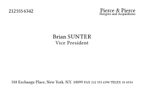

# Typeset Business Card Templates

A collection of professionally-designed business card templates for Typeset. Each template is carefully crafted with attention to typography, spacing, and visual hierarchy to help you create stunning business cards that make a lasting impression.

## Available Templates

<div align="center">

> ### 🔵 Full Circle
>
> A modern business card with a striking circular monogram
>
> 
>
> - Eye-catching circular monogram that draws attention
> - Versatile design works for any industry
> - Perfect balance of personal branding and professionalism
> - Customizable color schemes to match your brand
>
> **[View Template →](full-circle/)**

> ### 🎨 Refine
> 
> An elegant business card that makes a lasting impression
> 
> 
> 
> - Timeless design with premium Baskerville typography
> - Thoughtful spacing that guides the eye
> - Luxurious feel with customizable accents
> - Perfect for creative and professional services
>
> **[View Template →](refine/)**

> ### 📄 Simple Modern
> 
> A clean business card that lets your details shine
> 
> 
> 
> - Crisp, minimalist layout that's easy to read
> - Modern typography that stands out
> - Flexible design adapts to any content length
> - Ideal for tech and contemporary businesses
>
> **[View Template →](simple-modern/)**

> ### 📚 Bold Serif
> 
> A confident business card with commanding presence
> 
> 
> 
> - Strong typography that demands attention
> - Strategic use of white space
> - Perfect hierarchy of contact information
> - Excellent for legal and financial professionals
>
> **[View Template →](bold-serif/)**

> ### 📚 Elegant Serif
> 
> A sophisticated business card with timeless appeal
> 
> 
> 
> - Classic design that never goes out of style
> - Refined typography for ultimate readability
> - Balanced layout with perfect proportions
> - Ideal for consultants and executives
>
> **[View Template →](elegant-serif/)**

> ### 👤 Big Name
> 
> A bold business card that puts your name first
> 
> 
> 
> - Dramatic name presentation that gets noticed
> - Modern layout with perfect proportions
> - Smart use of typography and spacing
> - Great for personal branding and freelancers
>
> **[View Template →](big-name/)**

> ### 💼 Patrick Bateman
> 
> A luxury business card with executive presence
> 
> 
> 
> - Premium design inspired by high-end stationery
> - Sophisticated typography and subtle textures
> - Meticulous attention to every detail
> - Perfect for executives and luxury brands
>
> **[View Template →](patrick-bateman/)**

</div>

## Quick Start

1. Make sure you have [Typeset](https://typst.app/) installed
   ```bash
   # Install using Cargo
   just install-typst
   
   # Verify installation
   just version
   ```
2. Clone this repository:
   ```bash
   git clone https://github.com/yourusername/typset-templates
   ```
3. Navigate to your chosen template directory:
   ```bash
   cd typset-templates/templates/simple-modern  # or other template name
   ```
4. Modify `main.typ` with your content

## Repository Structure
```
.
├── templates/
│   ├── simple-modern/    # Modern minimalist template
│   ├── bold-serif/       # Professional academic template
│   ├── elegant-serif/    # Classic scholarly template
│   ├── big-name/        # Modern resume template
│   └── patrick-bateman/ # Executive resume template
├── images/              # Template previews
├── justfile            # Build automation
└── README.md           # Documentation
```

## Building and Development

This repository includes a `justfile` with several useful commands:

```bash
just                    # Show available commands
just build              # Build specific template (default: simple-modern)
just build bold-serif   # Build a specific template
just all                # Build all templates
just watch simple-modern # Watch template for changes and rebuild
just clean              # Remove all build artifacts
just view              # Open compiled PDF (platform-independent)
just new-template name  # Create a new template scaffold
just list-templates    # List available templates
```

Each template is compiled to multiple formats:
- PDF (for final output)
- SVG (for preview images)
- PNG (high-resolution preview)

## Contributing

Contributions are welcome! To contribute:

1. Fork the repository
2. Create your feature branch
3. Commit your changes
4. Open a pull request

## License

MIT License - Feel free to use and modify these templates for your projects.

---

<div align="center">
<sub>Built with ❤️ for the Typeset community</sub>
</div>
